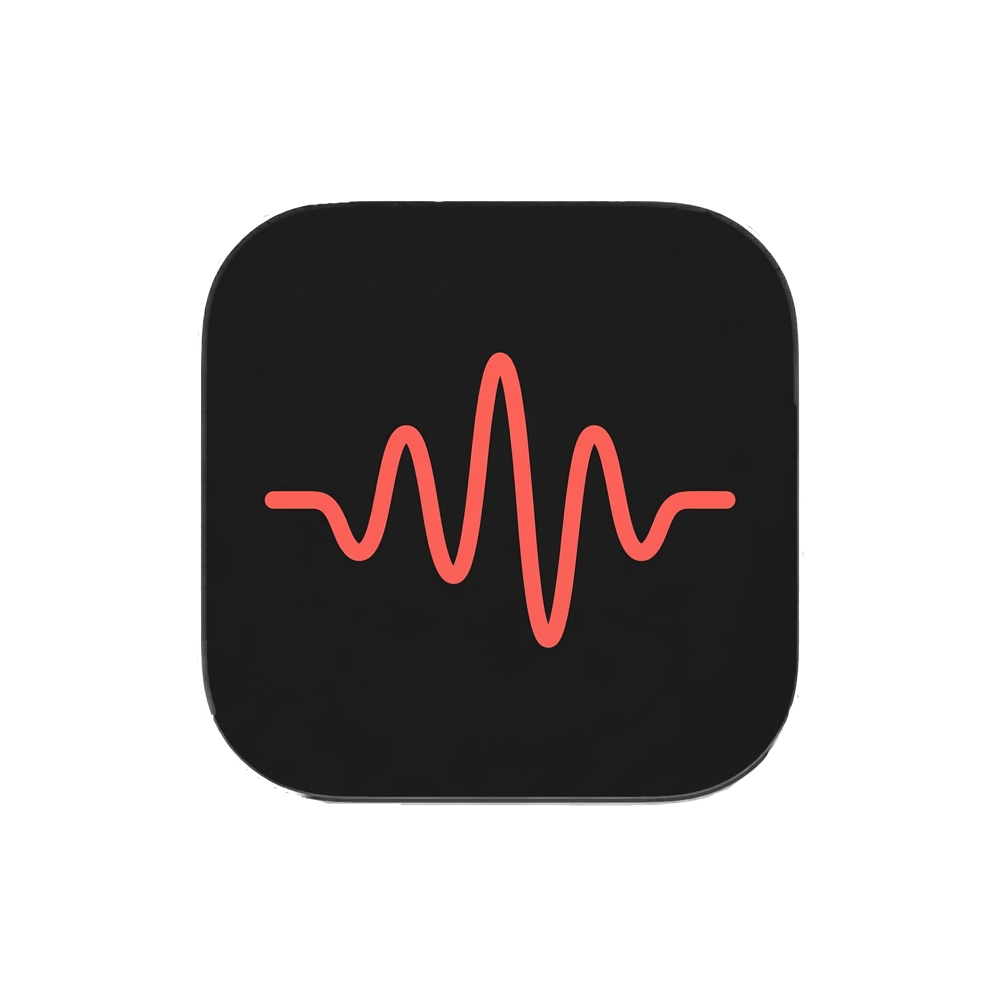

<p align="center">
  
</p>

# Scrawl

Local-first voice-to-text for macOS. Press a key, talk, text appears at your cursor. Everything runs on-device via [whisper.cpp](https://github.com/ggerganov/whisper.cpp) — nothing leaves your machine.

## How it works

1. Hold your hotkey (default: `Right Option`)
2. Speak
3. Release — transcript is pasted into whatever app you're focused on

Or double-tap the hotkey to toggle recording on, then single-tap to stop.

## Install

### Homebrew (recommended)

```bash
brew tap jetemple/tap
brew install --cask scrawl
```

### From source

Requires macOS 14+, Xcode command line tools, and `whisper-cli` from whisper.cpp.

```bash
brew install whisper-cpp

git clone https://github.com/Jetemple/Scrawl.git
cd scrawl
make install PREFIX=/Applications
open /Applications/Scrawl.app
```

On first launch, grant **Microphone** and **Accessibility** permissions when prompted.

Download a model from the Models menu:
- `medium` is the default recommendation on GPU-enabled Macs.
- `small.en` is the default recommendation when running CPU-only.

### Verify install in 30 seconds

1. Click the Scrawl menubar icon.
2. In **Models**, download `small.en`, `medium`, or `large-v3-turbo`.
3. Focus any text field.
4. Hold **Right Option**, speak, release.
5. Transcript should paste at cursor.

### Permissions after reinstalling

By default, source installs are unsigned (or ad-hoc signed), so Accessibility permission is reset on reinstall to avoid stale grants.

To avoid this, sign with a stable identity:

```bash
# find your identities
security find-identity -v -p codesigning

# install with a consistent signature
SCRAWL_CODESIGN_IDENTITY="Your Name (TeamID)" make install
```

With a stable signature, Scrawl keeps its Accessibility grant across reinstalls.

If microphone access seems stuck after a cask upgrade, reset permissions and relaunch:

```bash
tccutil reset Microphone com.jetemple.scrawl
tccutil reset Accessibility com.jetemple.scrawl
open /Applications/Scrawl.app
```

## Configuration

Scrawl lives in your menubar. From there you can:

- **Open Settings** - Manage permissions, models, the recording shortcut, transcript history, and preferred Vocabulary from a compact sidebar window.
- **Switch models** - tiny.en (fast), small.en (balanced), medium (multilingual), large-v3-turbo (highest accuracy).
- **Repaste recent transcripts** - Use the Recent Transcripts submenu for quick access or the searchable History page for copy, repaste, and delete actions.
- **Manage Vocabulary** - Add names, technical terms, and phrases that help Whisper recognize your language.

Transcript history is stored only on this Mac, enabled by default, and limited to the newest 100 transcripts. Turning off **Save transcript history** deletes saved transcripts and stops saving new ones until it is enabled again. Preferred Vocabulary terms are also stored locally and supplied to Whisper as recognition context.

## Development

```bash
make build      # build
make doctor     # check local toolchain/dependencies
make test       # run tests
make run        # stop an installed Scrawl instance and run this source build
make clean      # clean build artifacts
make uninstall  # remove app
```

Run directly from source:

```bash
make run
```

Override paths via environment variables:

```bash
SCRAWL_WHISPER_EXECUTABLE=/path/to/whisper-cli make run
SCRAWL_MODELS_DIR=/path/to/models make run
```

Performance tuning:

```bash
# cap whisper threads (default auto-selects up to 8)
SCRAWL_WHISPER_THREADS=8 make run

# force CPU-only mode (GPU is enabled by default)
SCRAWL_DISABLE_GPU=1 make run
```

Scrawl automatically uses GPU acceleration when available and falls back to CPU mode if GPU execution fails.

Debug mode (shows manual record/stop controls and overlay previews):

```bash
make run-debug
```

Debug mode adds manual Control-R and Control-S recording actions for diagnostics. They are not Scrawl's normal recording shortcut; normal recording always uses the configured hotkey.

## License

MIT
