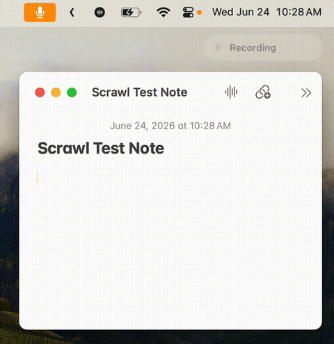

<p align="center">
  
</p>

<h1 align="center">Scrawl</h1>

<p align="center">
  <strong>Local voice-to-text for macOS.</strong><br>
  Hold a key, talk, let go. Your words appear at the cursor.
  Everything runs on your Mac: Parakeet v3 on Apple Silicon, or <a href="https://github.com/ggml-org/whisper.cpp">whisper.cpp</a> ggml models when you want them. No cloud, no account, no telemetry.
</p>

<p align="center">
  <a href="https://github.com/Jetemple/Scrawl/actions/workflows/ci.yml"></a>
  <a href="https://github.com/Jetemple/Scrawl/releases/latest"></a>
  <a href="https://github.com/Jetemple/Scrawl/releases"></a>
  
  <a href="LICENSE"></a>
</p>

<p align="center">
  
</p>

## What it does

Hold your hotkey (Right Option ⌥ by default), speak, and release. Scrawl transcribes on-device and pastes the result into whatever app you're using. Or double-tap to record hands-free, then tap again to stop.

## Install

Requires macOS 14 or later. Runs best on Apple Silicon.

**Homebrew**

```bash
brew tap jetemple/tap
brew trust jetemple/tap          # trust the third-party tap (one-time)
brew install --cask scrawl
```

Upgrade later with `brew upgrade --cask scrawl`.

**From source**

Needs the Xcode command line tools. Install `whisper-cpp` too if you want Whisper models or bring-your-own ggml models.

```bash
git clone https://github.com/Jetemple/Scrawl.git
cd Scrawl && make install PREFIX=/Applications
open /Applications/Scrawl.app
```

On first launch, grant Microphone and Accessibility. On Apple Silicon, use Parakeet v3 for the recommended fully local setup. To use Whisper instead, install `whisper-cpp`, then open the menubar's Models menu and download one: `small.en` (470 MB) is a fast, English-only default; `medium` (1.5 GB) handles other languages; `large-v3-turbo` (1.6 GB) is the most accurate. Then focus a text field, hold Right Option ⌥, and talk.

## Features

- **Fully local.** Audio never leaves your Mac.
- **Pastes at the cursor.** Straight into the focused field, or the clipboard if an app blocks it.
- **Apple Silicon default.** Parakeet v3 is the recommended on-device model on arm64 Macs.
- **Bring your own Whisper model.** Download a built-in size (tiny/small/medium/large-v3-turbo), or load any whisper.cpp ggml model.
- **Stays warm.** Keeps the model in memory between recordings, unloads it after idle. GPU by default, CPU fallback.
- **Custom vocabulary.** Teach it the names, jargon, and acronyms you use.
- **Local history.** Last 100 transcripts, searchable, on-device. One switch wipes them.
- **Launch at login.** Start Scrawl in the menu bar when you sign in, from Settings → General.

## Bring your own model

If it runs on [whisper.cpp](https://github.com/ggml-org/whisper.cpp) and it's a ggml `.bin`, Scrawl loads it: quantized builds, [distil-whisper](https://huggingface.co/distil-whisper), your own fine-tunes.

Add one under **Models** in Settings:

- **Add Model…** imports a `.bin` you've downloaded, after checking it's a real ggml model.
- **Reveal Models Folder** opens the folder so you can drop `ggml-*.bin` files straight in.

[ggerganov/whisper.cpp](https://huggingface.co/ggerganov/whisper.cpp/tree/main) on Hugging Face has every size, plus `q5`/`q8` quantized variants. Non-Whisper models won't load.

## Troubleshooting

<details>
<summary>Permissions reset after a reinstall or upgrade</summary>

Source builds are unsigned, so macOS drops the Accessibility grant on reinstall. Sign with a stable identity to keep it:

```bash
security find-identity -v -p codesigning          # find your identity
SCRAWL_CODESIGN_IDENTITY="Your Name (TeamID)" make install
```

If the mic or accessibility gets stuck after an upgrade, reset and relaunch:

```bash
tccutil reset Microphone com.jetemple.scrawl
tccutil reset Accessibility com.jetemple.scrawl
open /Applications/Scrawl.app
```
</details>

<details>
<summary>Text goes to the clipboard instead of pasting</summary>

Some app has macOS Secure Keyboard Entry on, often a terminal or password manager, which blocks synthesized ⌘V system-wide. Scrawl writes into native text fields through the Accessibility API where it can, and otherwise leaves the text on the clipboard. Press ⌘V to paste, or turn off secure input in the app that switched it on.
</details>

## Development

```bash
make build      # build
make test       # run tests
make doctor     # check toolchain and dependencies
make run        # run this source build
make run-debug  # same, plus manual record/stop controls for diagnostics
make clean
make uninstall
```

Environment overrides:

```bash
SCRAWL_WHISPER_EXECUTABLE=/path/to/whisper-cli make run   # custom whisper binary
SCRAWL_MODELS_DIR=/path/to/models make run                # custom models directory
SCRAWL_WHISPER_THREADS=8 make run                         # cap threads (auto-selects up to 8)
SCRAWL_DISABLE_GPU=1 make run                             # force CPU-only
```

## License

MIT
